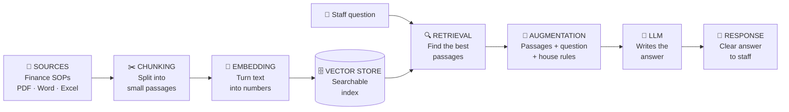
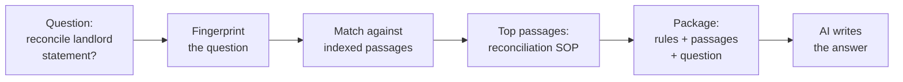
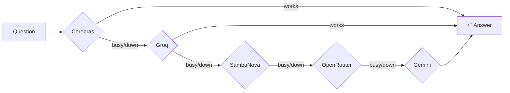
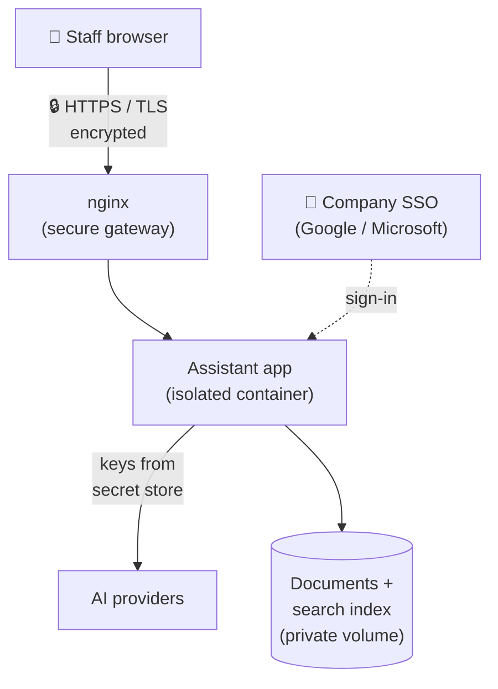
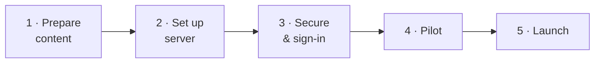

# Document AI Assistant — How It Works
### A plain-English guide for management

This document explains, from top to bottom, how our internal AI assistant works:
how it reads our documents, how it produces answers, why it sounds the way it
does, how it is hosted securely, and what we will do to take it live. We use the
**Finance module** as the running example throughout.

---

## 1. What it is (in one paragraph)

It is a private chatbot that answers questions using **only our own documents**.
Staff type a question in plain English — for example *"How do I reconcile a
landlord's month-end statement?"* — and the assistant replies with a clear,
step-by-step answer drawn from our finance procedures. It does **not** browse the
internet and does **not** make things up: if the answer isn't in our documents,
it says so. Think of it as a very well-read colleague who has memorised every
finance SOP and is available 24/7.

---

## 2. The big picture — the pipeline

Behind the scenes, every answer travels through a pipeline. This is the same
flow shown in the architecture blueprint:



**In everyday terms:**

| Stage | What it does | Finance example |
|-------|--------------|-----------------|
| **Sources** | We load the documents | The Finance SOP, reconciliation guide, month-end checklist |
| **Chunking** | We cut each document into bite-sized passages | The SOP becomes ~40 short passages |
| **Embedding** | We convert each passage into a list of numbers that captures its *meaning* | "reconcile landlord statement" and "match the landlord's balance" land near each other |
| **Vector store** | We keep those numbers in a fast, searchable index | Like a smart filing cabinet organised by meaning, not A–Z |
| **Retrieval** | For each question, we pull only the most relevant passages | Question about reconciliation → pulls the 3–5 reconciliation passages |
| **Augmentation** | We hand the model the passages + the question + our writing rules | "Here's the relevant SOP text, answer this question, in our style" |
| **LLM** | The AI writes the answer from that material | Produces the numbered steps |
| **Response** | Staff see a clean, readable reply | See the example in Section 6 |

---

## 3. Two ways the bot can read the documents

The assistant has a switch with two modes. This matters for cost and accuracy as
we grow.

| | **Full context** (simple) | **Smart retrieval / RAG** (scales) |
|---|---|---|
| How it reads | Sends **every** document to the AI on every question | Sends **only the relevant passages** per question |
| Best for | Small knowledge bases | Large or growing knowledge bases |
| Cost | High (pays for the whole library each time) | Low (pays only for what's relevant) |
| Accuracy | Can get "lost" in too much text | Sharper — the AI sees only what matters |
| Analogy | Reading the whole manual to answer one question | Flipping straight to the right page |

> **RAG** stands for *Retrieval-Augmented Generation* — a fancy way of saying
> "find the right passages first, then let the AI write the answer." It is the
> industry-standard approach and the one we use to keep costs low and answers
> accurate.

---

## 4. How RAG actually works — a finance walkthrough

Let's follow one real question all the way through.

**The document (already loaded):** *Finance SOP.docx* contains, among other
things, this passage:

> *"Month-end landlord reconciliation: open **Reports → Landlord Statements**,
> select the period, and compare the closing balance against the bank ledger.
> Any difference over £5 must be investigated before statements are released."*

**Step 1 — Chunking (done once, in advance).**
The SOP is split into small passages. The paragraph above becomes one passage,
tagged with its source file (`Finance SOP.docx`).

**Step 2 — Embedding (done once, in advance).**
Each passage is turned into a "meaning fingerprint" (a list of numbers). Passages
about reconciliation cluster together, separate from passages about, say, payroll.

**Step 3 — A staff member asks:**

> *"How do I reconcile the landlord's month-end statement?"*

**Step 4 — Retrieval.**
The question gets its own fingerprint, and the system instantly finds the closest
passages — the reconciliation paragraph scores highest and is pulled out. Only
those few passages move forward (not the whole SOP).

**Step 5 — Augmentation.**
The system assembles a package for the AI:

```
[Our house rules for how to answer]
+
[The retrieved reconciliation passages from Finance SOP.docx]
+
[The staff member's question]
```

**Step 6 — The LLM writes the answer** from that package only.

**Step 7 — The staff member sees the response** (Section 6).



---

## 5. How the bot never goes down — the "waterfall"

The assistant is connected to **five** AI providers. If one is busy, rate-limited,
or having an outage, it automatically slides to the next — the user never sees an
error. This is why it stays reliable.



---

## 6. Why it sounds the way it sounds

The assistant's "personality" is not random — it follows a fixed set of house
rules we wrote (its *system prompt*). These rules make it helpful, safe, and
on-brand. The key rules:

- **Stay grounded:** only answer from our documents; if it's not there, say so.
- **Never invent details:** if a specific figure or button isn't stated, say it
  isn't specified rather than guessing.
- **Be a partner, not a search engine:** keep answers bite-sized, offer to go
  deeper, and if there are two ways to do something, ask which one they want.
- **Format for humans:** number the steps, bold the menu paths.
- **Speak naturally:** don't robotically say "according to document X."

**What an answer actually looks like** (to the finance question above):

> ### Reconciling a landlord's month-end statement
> Here's the process:
>
> 1. Go to **Reports → Landlord Statements**.
> 2. Select the month you're closing.
> 3. Compare the **closing balance** against the **bank ledger**.
> 4. If there's a difference **over £5**, investigate it before releasing the statement.
>
> Would you like me to walk through how to investigate a difference, or how to
> release the statements once they balance?

Notice: it's short, numbered, bolds the menus, and offers a helpful next step —
exactly as the rules intend.

**What it does when the answer isn't in our documents:**

> *"I couldn't find that in the current finance documents — it may not be covered
> yet. Would you like me to look at a related topic, such as the month-end
> checklist?"*

This is deliberate. It protects us from confident-but-wrong answers.

---

## 7. How it's hosted (securely)

The system runs on our own server, inside a locked-down container, behind an
encrypted connection.



**In plain terms:**

- **Encrypted in transit:** all traffic is HTTPS/TLS — nobody can eavesdrop.
- **Login required:** staff sign in with our company SSO (their normal work
  account). We can restrict access to our email domain only.
- **Admin-only uploads:** only named administrators can add or remove documents.
- **Secrets stay secret:** all API keys live in a protected secret store, never
  in the code, never shown on screen, never written to logs. Even if an error
  occurs, any key is automatically blanked out.
- **Runs isolated:** the app runs as a non-privileged user inside a container;
  the server only exposes the secure gateway.

---

## 8. Security, in the terms management cares about

| Concern | How we handle it |
|---------|------------------|
| Could an API key leak? | Keys are held in a secret store, used server-side only, and scrubbed from any error or log. Verified by test. |
| Who can see the documents? | Only signed-in staff; uploads are admin-only. |
| Is the connection safe? | Yes — enforced HTTPS/TLS with modern security headers. |
| Can it be spammed / run up cost? | Per-user rate limiting caps usage; failed logins lock out after repeated attempts. |
| Can someone upload a malicious file name? | File names are sanitised and type-checked; path tricks are blocked. |
| Will it invent answers? | No — it is instructed to answer only from our documents and to admit when something isn't covered. |
| What's still our job? | Keep the server patched, hold valid TLS certificates, and rotate keys. (Detailed in `SECURITY.md`.) |

---

## 9. What to expect — and what it won't do

**Great at:**
- Answering "how do I…" and "what is our policy on…" questions from our SOPs.
- Giving consistent, step-by-step guidance to every staff member.
- Being available instantly, 24/7, without tying up a senior colleague.

**Not designed to:**
- Answer questions about topics we haven't uploaded (it will say it doesn't know).
- Make judgement calls, approve exceptions, or give regulated financial advice.
- Replace the source documents — it points to *what the documents say*.

Being clear about these limits is what keeps it trustworthy.

---

## 10. What we'll do to go live



| Phase | What happens | Owner | Status |
|-------|--------------|-------|--------|
| **1. Prepare content** | Gather and tidy the Finance SOPs to upload as the first knowledge base | Finance / Ops | To do |
| **2. Set up server** | Install Docker, deploy the app container behind the secure gateway | IT | Build ready |
| **3. Secure & sign-in** | Add TLS certificate, connect company SSO, rotate API keys | IT | Build ready |
| **4. Pilot** | A small finance group tests real questions; we refine the documents and prompt | Finance + us | Next |
| **5. Launch** | Open to wider staff; monitor and add more document sets (HR, Compliance…) | All | After pilot |

**What we need to decide / provide:**
1. Which documents form the first knowledge base (recommend: Finance module).
2. Our SSO provider (Google Workspace or Microsoft 365).
3. A domain/subdomain to host it on (e.g. `assistant.ourcompany.com`).
4. Fresh API keys (at least one; more = higher reliability).

Everything on the software side is **already built, tested, and ready to deploy** —
the remaining work is content, credentials, and the server setup above.

---

## 11. One-line summary for the board

> *We've built a secure, private AI assistant that answers staff questions from
> our own documents — accurate, always available, on-brand, and cheap to run —
> starting with the Finance module and expandable to every department.*
